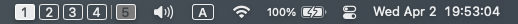

<div align="center">

<div style="display:flex;">
    
    <h1>Yabai Indicator</h1>
</div>
<p>Clickable spaces switcher powered by Yabai</p>


<p>Shows a row clickable buttons for all workspaces including fullscreen applications</p>
<br>


<p>Alternatively show miniature windows.</p>
<br>



<p>Also supports multiple displays (with separate spaces).</p>
<br>


<p>Show only active space(s)</p>

</div>

## Requirements

 [Yabai](https://github.com/koekeishiya/yabai) is required to be running to keeping spaces information in sync and showing individual windows.

Keyboard shortcut setup is required: Create 16 spaces, and assign some modifiers for those 1-10 (1-0) and add one extra for 11-16 (1-6) like in the picture below, and you can then remove the spaces
(if you're going to use faster space switch animation, also bind Next and Last space to something other than the shortcut you'll use in the setup)


## Installation

Requires macOS 12+
If you don't have yabai, install yabai (version 4.0.2 required) first: [Official installation guide](https://github.com/koekeishiya/yabai/wiki/Installing-yabai-(latest-release))

I haven't setup builds or builds uploading, so just open the project in Xcode, set your signing team, and make a new bundle identifier and build.

To keep spaces and windows in sync, add the following to your `.yabairc`:

```bash
yabai -m signal --add event=mission_control_enter action='notifyutil -p ExposeStart'
yabai -m signal --add event=mission_control_exit action='notifyutil -p ExposeEnd'

window_events=("window_created" "window_destroyed" "window_focused" "window_moved" "window_resized" "window_minimized" "window_deminimized")
for event in "${window_events[@]}"; do
yabai -m signal --add event=$event action='notifyutil -p WindowChange'
done
```

This sends a refresh command to Yabai Indicator via notifyd.

## Extra features
My hammerspoon script communicates with this app to allow fast space switching (don't forget to turn off or change the shortcut in settings)'
```lua
local ctrl = { "ctrl" }
hotkey.bind(ctrl, "left", function() hs.execute("notifyutil -p LastSpace") end)
hotkey.bind(ctrl, "left", function() hs.execute("notifyutil -p NextSpace") end)
```
Or it could be for skhd
```bash
ctrl - left : notifyutil -p LastSpace
ctrl - right : notifyutil -p NextSpace
```

## Comparison to similar applications

 [YabaiInidicator (Original)](https://github.com/xiamaz/YabaiIndicator) Requires SIP to be disabled to switch spaces. A little bit outdated. Design difference. Supports slightly older os versions.

 [SpaceId](https://github.com/dshnkao/SpaceId) has some additonal configurability for presentation and also allows showing all active spaces on all displays. Switching between spaces is not implemented. As of 12/2021 it does not utilize Acessibility API for catching MissionControl invocation. It does not have a dependency on Yabai.

 [WhichSpace](https://github.com/gechr/WhichSpace) shows the current active Space in a single indicator. Does not allow for showing all spaces or all visible spaces on multiple displays.

## Current bugs
- Random crashes

## To-do
- ~~Reimplement space switching with `yabai -m space --focus`~~   **yabai-sa also patches the space switch animation for the method used here**
