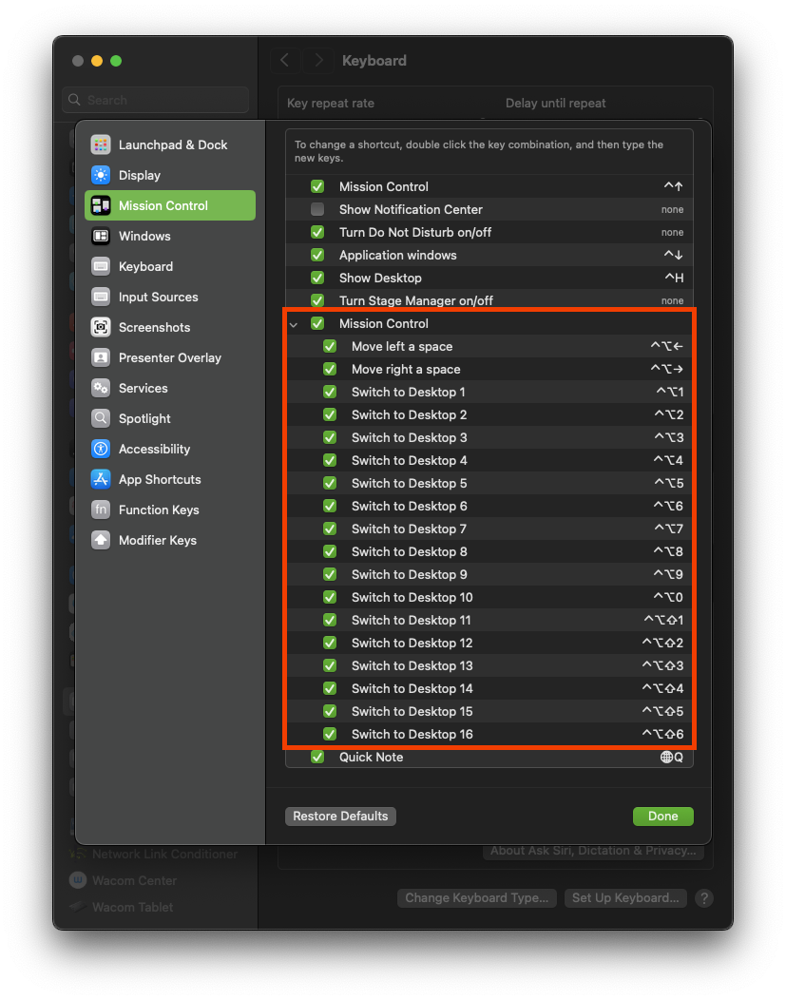

<div align="center">
    
    <h1>Yabai Indicator</h1>
    <p>
        <b>Clickable spaces switcher powered by Yabai</b>
    </p>


<p>Shows a row clickable buttons for all workspaces including fullscreen applications</p>


<p>Alternatively show miniature windows.</p>


<p>Also supports multiple displays (with separate spaces).</p>


<p>Fullscreen applications.</p>


<p>Show only active space(s)</p>
</div>

## Requirements

[Yabai](https://github.com/koekeishiya/yabai) is required to be running for the space switching and keeping spaces information in sync and showing individual windows.

Keyboard shortcut setup is required: Create 16 spaces, and assign some modifiers for those 1-10 (1-0) and add one extra for 11-16 (1-6) like in the picture below, and you can then remove the spaces


## Installation

Requires macOS 12+
If you don't have yabai, install yabai (version 4.0.2 required) first: [Official installation guide](https://github.com/koekeishiya/yabai/wiki/Installing-yabai-(latest-release))

I haven't setup builds or builds uploading, so just open the project in Xcode, set your signing team, and make a new bundle identifier and build. Make sure to revolke and regrant accessibility permissions if build is updated.

In order to allow for showing windows and keeping the spaces in sync, when spaces are removed in mission control the following signals need to be added to your `.yabairc`:

```
yabai -m signal --add event=mission_control_enter action='notifyutil -p ExposeStart'
yabai -m signal --add event=mission_control_exit action='notifyutil -p ExposeEnd'

window_events=("window_created" "window_destroyed" "window_focused" "window_moved" "window_resized" "window_minimized" "window_deminimized")
for event in "${window_events[@]}"; do
  yabai -m signal --add event=$event action='notifyutil -p WindowChange'
done
```

If certain keybinds modify the spaces arrangement the following commands needs to be added to keep the indicator in sync:

```
notifyutil -p WindowChange
```

This sends a refresh command to Yabai Indicator via a unix-domain socket.

## Comparison to similar applications

[YabaiInidicator (Original)](https://github.com/xiamaz/YabaiIndicator) Requires SIP to be disabled to switch spaces, and has a slightly more outdated codebase (according to me). Opening settings from menu bar doesn't work on macOS 14+. Had a blurry text issue on retina displays. Took up more space in menubar due to wider buttons. The buttons also didn't line up with other menu bar items

[SpaceId](https://github.com/dshnkao/SpaceId) has some additonal configurability for presentation and also allows showing all active spaces on all displays. Switching between spaces is not implemented. As of 12/2021 it does not utilize Acessibility API for catching MissionControl invocation. It does not have a dependency on Yabai.

[WhichSpace](https://github.com/gechr/WhichSpace) shows the current active Space in a single indicator. Does not allow for showing all spaces or all visible spaces on multiple displays.
